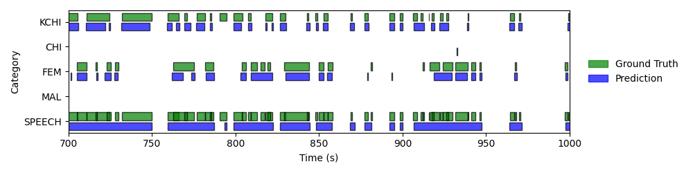
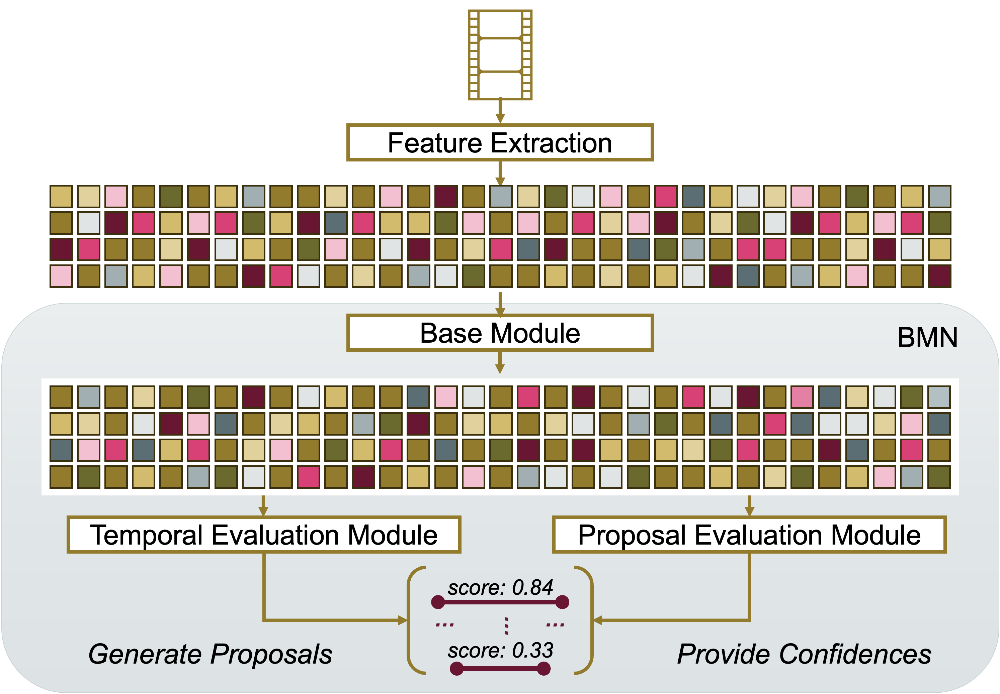

```{r setup, include = FALSE}
library(papaja)
library(tidyverse)
library(ggplot2)
library(brms)
library(ggthemes)
library(ggpubr)
library(BayesFactor)
library(broom)
library(coda)
library(reshape2)
library(ggridges)
library(readxl)
library(dplyr)
library(lubridate)
library(zoo)
library(gridExtra)
library(grid)
library(kableExtra)
library(cowplot)
library(patchwork)
library(magick)
library(ggplotify)


estimate_mode <- function(s) {
  d <- density(s)
  return(d$x[which.max(d$y)])
}

hdi_upper<- function(s){
  m <- HPDinterval(mcmc(s))
  return(m["var1","upper"])
}

hdi_lower<- function(s){
  m <- HPDinterval(mcmc(s))
  return(m["var1","lower"])
}
```

```{r analysis-preferences}
# Seed for random number generation
set.seed(42)
knitr::opts_chunk$set(cache.extra = knitr::rand_seed)
knitr::opts_chunk$set(echo = F, warning = F, message = F)
```

```{r video-statistics, echo=FALSE, message=FALSE, warning=FALSE}
min_class_duration <- 2.47 #in minutes
max_class_duration <- 1849.30 #in minutes
annotation_progress_duration = 55 # in hours 

data <- read_csv2("data/ChildLens_data_sheet.csv")
subject_infos <- read_csv2("data/ChildLens_subjects.csv")
subject_infos <- subject_infos %>%
  distinct(child_id, .keep_all = TRUE)

unique_data <- data %>%
  filter(!is.na(Minutes_per_ID), Minutes_per_ID != 0, 
         !is.na(child_id), !is.na(Labeled)) %>%
  distinct(child_id, Minutes_per_ID, .keep_all = TRUE)
unique_data <- unique_data %>%
  mutate(child_id = as.double(child_id))

cleaned_data <- data %>%
  filter(!is.na(Minutes_per_ID), Minutes_per_ID != 0, 
         !is.na(child_id), !is.na(Labeled))
sum_videos <- nrow(cleaned_data)

data_gender_count <- unique_data %>%
  left_join(subject_infos, by = "child_id") %>%
  distinct(child_id, .keep_all = TRUE)
male_count <- data_gender_count %>%
  filter(gender == "Male") %>%
  nrow()
female_count <- data_gender_count %>%
  filter(gender == "Female") %>%
  nrow()

data_age_count <- cleaned_data %>%
  left_join(subject_infos, by = "child_id") %>%
  mutate(Date = as.Date(Date, format = "%Y-%m-%d")) %>%
  mutate(birthday = as.Date(birthday, format = "%d.%m.%Y")) 


data_age_count <- data_age_count %>%
  mutate(
    Age = as.numeric(difftime(Date, birthday, units = "weeks")) / 52.25,  # Calculate age in years
    Age_group = case_when(
      Age >= 2 & Age < 4 ~ "3",
      Age >= 4 & Age < 5 ~ "4",
      Age >= 5 ~ "5",
      TRUE ~ NA_character_  # For cases where age is missing or not within the desired ranges
    )
  )

mean_age <- mean(data_age_count$Age, na.rm = TRUE)
sd_age <- sd(data_age_count$Age, na.rm = TRUE)

hours_3_plus <- sum(data_age_count$Seconds[data_age_count$Age_group == 3], na.rm = TRUE) / 3600
hours_4_plus <- sum(data_age_count$Seconds[data_age_count$Age_group == 4], na.rm = TRUE) / 3600
hours_5_plus <- sum(data_age_count$Seconds[data_age_count$Age_group == 5], na.rm = TRUE) / 3600

min_minutes <- round(min(cleaned_data$Minutes_per_ID))
max_minutes <- round(max(cleaned_data$Minutes_per_ID))
mean_minutes <- mean(cleaned_data$Minutes_per_ID, na.rm = TRUE)
sd_minutes <- sd(cleaned_data$Minutes_per_ID, na.rm = TRUE)

sum_hours <- sum(cleaned_data$Seconds)/3600
nr_children <- nrow(unique_data) 

annotation_progress <- round(annotation_progress_duration / sum_hours * 100)

oldest_date <- min(cleaned_data$Date)
youngest_date <- max(cleaned_data$Date)

oldest_year <- as.numeric(format(oldest_date, "%Y"))
oldest_month <- as.numeric(format(oldest_date, "%m"))
youngest_year <- as.numeric(format(youngest_date, "%Y"))
youngest_month <- as.numeric(format(youngest_date, "%m"))

# Calculate the interval between the two dates
time_span_months <- (youngest_year - oldest_year) * 12 + (youngest_month - oldest_month)+1
```

# Introduction
In developmental psychology, everyday experiences play a central role when theorizing about the causes and dynamics of developmental change [@piagetPartCognitiveDevelopment1964; @vygotskyMindSocietyDevelopment1978; @rogoffImportanceUnderstandingChildrens2018; @carpendaleWhatMakesUs2020; @smithDevelopingInfantCreates2018; @tomaselloCulturalOriginsHuman2009; @heyesCognitiveGadgetsCultural2018]. Famously, the two central processes in Piaget's theory of cognitive development - assimilation and accommodation - describe how children's cognitive abilities change in line with the experiences they make [@piagetPartCognitiveDevelopment1964]. Vygotsky emphasized the role of social interactions between children and (knowledgeable) adults for the acquisition of culturally relevant knowledge [@vygotskyMindSocietyDevelopment1978]. Contemporary theorists rest on similar ideas. For example, @tomaselloCulturalOriginsHuman2009 pointed out how everyday social interactions, particularly those involving shared intentionality, foster uniquely human forms of communication, cooperation and cognition. For @heyesCognitiveGadgetsCultural2018, culturally evolved "cognitive gadgets" are transmitted via language in conversations between adults and children. 

These broad theoretical accounts are based on empirical support. Reviewing evidence for all these theoretical accounts is beyond the scope of this paper, so we want to point out only a few examples from the domain of language development. Across languages and cultural settings, the amount of language children hear is related to their language development [@bergelsonEverydayLanguageInput2023]. There is also a relationship between the amount of conversational turn-taking children are engaged in and their vocabulary growth [@ferjanramirezParentCoachingIncreases2020; @donnellyLongitudinalRelationshipConversational2021]. @royPredictingBirthSpoken2015 showed that words that are heard in distinct contexts at distinct times are more likely to be learned. @ruffmanExposureBehavioralRegularities2023 used head-mounted video cameras to study how repeated behaviors in everyday life correlate with the acquisition of mental state vocabulary. Taken together, such studies illustrate how important it is to study naturalistic everyday experiences to understand children's development. However, studies linking everyday experience and development are still vastly underrepresented [@debarbaroTenLessonsInfants2022; @rogoffImportanceUnderstandingChildrens2018] as they come with a set of unique challenges.

Perhaps the most significant obstacle in this field is the extensive amount of data needed to comprehensively study children’s everyday experiences. Traditional methods, such as manual annotation, are time-consuming and impractical for large-scale datasets. To address this, computer vision or Natural Language Processing (NLP) models offer scalable solutions for analyzing social interactions and behaviors. For instance, OpenPose [@caoOpenPoseRealtimeMultiPerson2018] allows the tracking of human body, face, and hand poses which provides valuable insights into gestures and engagement. YOLOv8 [@redmonYouOnlyLook2015] offers efficient object detection and models like I3D [@carreiraQuoVadisAction2017] provide an automated solution for classifying activities in video data. For audio, Wave2Vec 2.0 [@baevskiWav2vec20Framework2020] provides robust speech-to-text and speech representation capabilities, enabling the study of conversational dynamics. Together, these models facilitate the efficient analysis of multimodal data. However, even the best model architecture needs diverse, high-quality datasets to learn from. A notable example of such a dataset is ImageNet [@russakovskyImageNetLargeScale2014]; in fact, the release of this dataset sparked the development of some of the most prominent computer vision models available today. Similarly, expanding publicly available datasets in developmental psychology could accelerate progress in studying children’s everyday experiences. 

Several publicly available datasets have made valuable contributions to our understanding of children’s social and communicative behavior. For example, the SAYCam dataset [@sullivanSAYCamLargeLongitudinal2021] provides audio-video recordings from 3 infants (6–32 months) who wore head-mounted cameras over two years, to capture naturalistic speech and behaviors. Similarly, the DAMI-P2C dataset [@chenDyadicAffectParentChild2023] includes audio and video recordings of parent-child interactions during story reading, with annotations for body movements in a controlled environment. The MMDB dataset [@rehgDecodingChildrensSocial2013] offers multimodal data (audio, video, physiological) of children (15–30 months) engaged in semi-structured play interactions, recorded in a lab. Another example is the UpStory dataset [@fraileUpStoryUppsalaStorytelling2024], which features audio and video of primary school children (eight to ten years) in dyadic storytelling interactions, also recorded in a lab setting. Additionally, the BabyView dataset [@longBabyViewDatasetHighresolution2024] provides high-resolution, egocentric video of children aged six months to three years, recorded at home and in preschool environments, with annotations for speech transcription and pose estimation. Whereas these datasets vary in age, setting, and target behaviors, they collectively highlight the need for more naturalistic, at-home datasets that can capture the full range of children’s daily activities.

To address this gap, we introduce the publicly available ChildLens dataset, which focuses on activity annotations for children aged three to five years. The dataset consists of `r sum_hours` hours of video and audio recordings collected from `r nr_children` children in their home environment through a 140° wide-lens camera, integrated in a child-friendly vest (see also @zahraComputerVisionAnalyzing2024). It includes detailed annotations for five location classes and 14 activity classes, which are further categorized based on whether the child is interacting alone or with others. Designed to support research in developmental psychology and computer vision, the ChildLens dataset offers a rich resource for advancing multimodal learning and studying the full spectrum of children’s daily activities. As of now, `r annotation_progress`% (around `r annotation_progress_duration` hours) of the dataset are annotated. The annotation process is ongoing.

# Dataset Generation
This section outlines the steps taken to create the ChildLens dataset. We provide detailed information on the video collection process, the labeling strategy employed, and the generation of activity labels.

## Step 1: Collection of Egocentric Videos
The ChildLens dataset consists of egocentric videos recorded by children aged three to five years over a period of `r time_span_months` months. A total of `r nr_children` children from families living in a mid-sized city in Germany, participated in the study. The videos were captured at home using a camera embedded in a vest worn by the children, as shown in figure \@ref(fig:camera-superannotate-activity-classes). This setup allowed the children to move freely throughout their homes while recording their activities. The camera, a _PatrolEyes WiFi HD Infrared Police Body Camera_, was equipped with a 140° wide-angle lens and captured the space in front of the child with a resolution of 1920x1080p at 30 frames per second. The camera also recorded high-quality audio, allowing us to capture the child's speech and other sounds in the environment. 

In order to obtain a decent coverage for the different activity classes we planned to annotate, we handed parents a short checklist of activities to record. The focus was on capturing everyday activities that children typically engage in. Parents were therefore asked to include the following elements in the recordings:

- Child spends time in different rooms and performs various activities in each room
- Child is invited to read a book together with an adult
- Child is invited to play with toys alone
- Child is invited to play with toys with someone else (adult or child)
- Child is invited to draw/craft something

```{r camera-superannotate-activity-classes, echo=FALSE, dpi=600, fig.align='center', fig.cap="\\textbf{A} – Vest with the integrated camera worn by the children, \\textbf{B} – Collage of 9 screenshots showing activities (top left to bottom right): crafting, dancing, drawing, making music, reading a book, watching something, playing with an object, playing without an object, and pretend play, \\textbf{C} – Activity classes in the ChildLens dataset.", out.width='100%'}
knitr::include_graphics("images/dataset_overview.png")
```

## Step 2: Creation of Labeling Strategy
To create a comprehensive labeling strategy for the ChildLens dataset, we first defined a list of activities that children typically engage in. This list was inspired by previous research on activities that children are known to participate in [@hofferthHowAmericanChildren2001; @ginsburgImportancePlayPromoting2007]. From this, we derived a detailed catalog of activities that were likely to be captured in the videos and chose to make the activity classes more granular by distinguishing between activities like "making music" and "singing/humming" or "drawing" and "crafting things". 

After an initial review of the videos, we decided to add another class "overheard speech" to capture situations in which the child is not directly involved in a conversation but can hear it. We also added "pretend play" as a separate class to capture situations in which the child is engaged in imaginative play. This approach allowed us to capture the diversity of activities that children engage in and create a comprehensive dataset for activity analysis.

## Step 3: Manual Labeling Process
Before the actual annotation process, a setup meeting was held to introduce the annotators to the labeling strategy. To familiarize themselves with the task, the annotators were assigned 25 sample videos to practice and gain hands-on experience. These initial annotations were reviewed by the research team, and feedback was provided to refine the approach. A total of three feedback loops were conducted to ensure that the annotators follow the labeling strategy properly.

The videos were manually annotated by native German speakers who watched each video and labeled the activities present in the footage. Annotators marked the start and end points of each activity. For audio annotations, we implemented a two-second rule for all audio-based activity classes: if the break between two instances was two seconds or less, it was considered a single event; breaks longer than two seconds split the activity into separate instances.


# Dataset Overview

#### Activity Classes
The ChildLens dataset includes 14 activity classes and five location classes. A brief description of each class can be found in table \@ref(tab:activity-classes-description). The location classes describe the current location of the child in the video and include _livingroom_, _playroom_, _bathroom_, _hallway_, and _other_.
The activity classes are categorized based on the child’s interactions within the video and can be divided into _person-only_ activities (e.g. "child talking", "other person talking"), and _person-object_ activities (e.g. "drawing", "playing with object"). These activities are further categorized into _audio-based_, _visual-based_, and _multimodal_ activities, as presented in figure \@ref(fig:camera-superannotate-activity-classes). Below is an overview of the different activity types:

- **Audio-based activities**: _child talking_, _other person talking_, _overheard speech_, _singing / humming_, _listening to music / audiobook_
- **Visual-based activities**: _watching something_, _drawing_, _crafting things_, _dancing_,  _playing with object_
- **Multimodal activities**: _playing without object_, _reading book_ , _making music_, _pretend play_

```{r activity-classes-description, echo=FALSE, dpi=600, fig.align='center'}
# Define the table data as a string with "|" delimiters
activity_data <- "Activity Class                | Description
                  Child talking                 | Talking to themselves or to someone else.
                  Singing/Humming               | Singing or humming a song or a melody.
                  Listening to music/audiobook  | Listening to music or an audiobook.
                  Watching something            | Watching a movie or video on either a screen or a device.
                  Drawing                       | Drawing or coloring a picture.
                  Crafting things               | Engaged in a craft activity, such as making a bracelet.
                  Dancing                       | Dancing to music or moving to a rhythm.
                  Playing with object           | Playing or interacting with an object, such as a toy or a ball.
                  Playing without object        | Playing without an object, such as playing hide and seek
                  Pretend play                  | Engaged in imaginative play, such as pretending to be a doctor.
                  Reading a book                | Reading a book or looking at pictures in a book.
                  Making music                  | Playing a musical instrument or making music in another way.
                  Other person talking          | Another person is talking to the child.
                  Overheard Speech              | Conversations the child can hear but is not directly involved in."

# Read the table into a data frame
activity_classes_table <- read.delim(
  textConnection(activity_data), 
  header = FALSE, 
  sep = "|", 
  strip.white = TRUE, 
  stringsAsFactors = FALSE
)

# Assign column names from the first row
names(activity_classes_table) <- unname(as.list(activity_classes_table[1, ]))

# Remove the first row (header row) from the data frame
activity_classes_table <- activity_classes_table[-1, ]

# Reset row names to NULL
row.names(activity_classes_table) <- NULL

# Use apa_table to display the table with a caption
apa_table(
  activity_classes_table,
  caption = "Activity classes in the ChildLens dataset (first 12 child-centered, last 2 other-person-centered).",
  escape = TRUE,
  align = c("l", "l")  # Left-align both columns
)
```

#### Statistics
The ChildLens dataset comprises of `r sum_videos` video files with a total of `r sum_hours` hours recorded by `r nr_children` children aged three to five years (M=`r mean_age`, SD=`r sd_age`), including `r female_count` female and `r male_count` male children. It contains `r hours_3_plus` hours from children aged three, `r hours_4_plus` hours from children aged four, and `r hours_5_plus` hours from children aged five. The video duration per child varies between `r min_minutes` and `r max_minutes` minutes (M=`r mean_minutes`, SD=`r sd_minutes`). A detailed distribution of the video duration per child is shown in figure \@ref(fig:minutes-per-child). 

```{r minutes-per-child, echo=FALSE, message=FALSE, warning=FALSE, fig.cap="Distribution of video recording duration (in minutes) per child.", fig.height=2.5, fig.width=3.5}
unique_data$child_id <- as.factor(unique_data$child_id)

ggplot(unique_data, aes(x = Minutes_per_ID)) +
  geom_point(aes(y = 0), shape = "I", size = 4) + 
  geom_density(fill = "gray", alpha = 0.5, color = "black") + 
  theme_minimal() +
  theme(legend.position = "none") +
  labs(
    x = "Minutes per child",
    y = "Density"
  )

#unique_data$ID <- as.factor(unique_data$ID)

#plot <- ggplot(unique_data, aes(x = Minutes_per_ID)) +
#  geom_point(aes(y = 0), shape = "I", size = 5) + 
#  geom_density(fill = "gray", alpha = 0.5, color = "black") + 
 # theme_minimal() +
 # theme(
  #  legend.position = "none",
   # axis.title = element_text(size = 25),      # Increase label size
    #axis.text = element_text(size = 25),       # Increase tick label size
    #axis.ticks.length = unit(0.5, "cm")        # Increase tick size
  #) +
  #labs(
  #  x = "Minutes per ID",
  #  y = "Density"
  #)

# Specify the file path and name
#output_folder <- "/Users/nelesuffo/Promotion/projects/leuphana-IPE/paper/images" 
#file_name <- "minutes_per_id_plot.png"
#file_path <- file.path(output_folder, file_name)

# Save the plot
#ggsave(filename = file_path, plot = plot, width = 3, height = 2, dpi = 100)
```

This diverse dataset includes a varying number of instances with different total duration across the 14 activity classes. While annotations are still ongoing, the current annotations (`r annotation_progress`% annotated) include between `r min_class_duration`  (making music) and `r max_class_duration` (playing with object) minutes per class. Depending on the activity class, the total duration for each activity class can consist of many shorter instances or fewer longer instances. For example, audio-based activities like "child talking" may last only a few seconds, while activities like "reading a book" can span several minutes. The total number of instances and summed duration for all activity classes is available in table \@ref(tab:activity-classes-statistics) in the appendix.

```{r minutes-per-child-density, echo=FALSE, message=FALSE, warning=FALSE, eval=FALSE}
unique_data$child_id <- as.factor(unique_data$child_id)

ggplot(unique_data, aes(x = Minutes_per_ID)) +
  geom_histogram(binwidth = 10) +
  scale_y_continuous(breaks = scales::pretty_breaks(n = 10), labels = scales::label_number(accuracy = 1)) +
  labs(x = "Minutes per ID", y = "Count") +
  theme_minimal()
```

```{r age-distribution, echo=FALSE, message=FALSE, warning=FALSE, eval=FALSE, fig.cap="Number of videos per age group."}
data_age_count_plot <- data_age_count
data_age_count_plot$child_id <- as.factor(data_age_count_plot$child_id)

ggplot(data_age_count_plot, aes(x = Age_group, fill = Age_group)) +
  geom_bar(position = "dodge", alpha = 0.7, width = 0.5) +
  scale_fill_manual(values = c("3+" = "#A6ADAF", "4+" = "#A18D92", "5+" = "#BBBB9B")) + 
  theme_minimal() +
  labs(
    x = "Age Group",
    y = "Count",
    fill = "Age Group"
  ) +
  theme(legend.position = "none")

plot_age <- ggplot(data_age_count_plot, aes(x = Age_group, fill = Age_group)) +
  geom_bar(position = "dodge", alpha = 0.7, width = 0.5) +
  scale_fill_manual(values = c("3+" = "#B7B794", "4+" = "#8A8A8A", "5+" = "#B7AD94")) + 
  theme(
    legend.position = "none",
    axis.title = element_text(size = 25),      # Increase label size
    axis.text = element_text(size = 25),       # Increase tick label size
    axis.ticks.length = unit(0.5, "cm")        # Increase tick size
  ) +  labs(
    x = "Age Group",
    y = "Count",
    fill = "Age Group"
  ) +
  theme(legend.position = "none")

# Specify the file path and name
output_folder <- "/Users/nelesuffo/Promotion/projects/leuphana-IPE/paper/images" 
file_name <- "video_count_per_age_group.png"
file_path <- file.path(output_folder, file_name)

# Save the plot
ggsave(filename = file_path, plot = plot_age, width = 8, height = 6, dpi = 300)
```

#### Data Availability
The ChildLens dataset will be made available to scientists for research purposes. It includes video and audio recordings, along with activity labels. Due to the sensitive nature of the data—recordings of children in their homes—access will be restricted.

Researchers can submit requests for access, which will be carefully reviewed to ensure proper handling and compliance with privacy standards. Please contact \href{mailto:ra@eva.mpg.de}{ra@eva.mpg.de} to request access to the dataset. As noted above, the annotation process is still ongoing and the dataset will be updated regularly. A brief project overview, along with the latest dataset version can be found on the [ChildLens website](https://www.eva.mpg.de/comparative-cultural-psychology/technical-development/childlens/). 

#### Exhaustive multi-label annotations
The dataset provides detailed annotations for each video file. These annotations specify the child’s current location within the video, the start and end times of each activity, the activity class, and whether the child is engaged alone or with somebody else. For every person involved in the activity, we capture age class and gender. If multiple activities occur simultaneously in a video, each activity is labeled individually. For example, if a segment shows a child “reading a book” while also “talking,” two separate annotations are created: one for “reading a book” and another for “child talking.” This exhaustive labeling strategy ensures that each activity is accurately represented in the dataset. 

# Benchmark Performance
In this chapter, we present the results of applying two model architectures to the currently annotated subset of the ChildLens dataset for two specific tasks: temporal activity localization using video data and voice type classification using audio data. For temporal activity localization, we used the Boundary-Matching Network (BMN) model [@linBMNBoundaryMatchingNetwork2019], a state-of-the-art approach in this domain, which we trained from scratch on the unique activity classes in the ChildLens video data. For voice type classification, we applied and trained the Voice Type Classifier (VTC) [@lavechinOpensourceVoiceType2020], also state-of-the-art, using three different evaluation setups. Both models provide initial results and establish a benchmark for future research. The model architectures for both, BMN and VTC, are displayed in figure \@ref(fig:bmn-architecture) and figure \@ref(fig:vtc-architecture) in the appendix, respectively.

All calculations were conducted on a Linux server equipped with two NVIDIA Quadro RTX 8000 GPUs, each with 48 GB of VRAM (CUDA version 12.5, driver version 555.42.06). The server had 48 CPU cores and 187 GB of RAM. The experiments were implemented in Python 3.8.18 for Temporal Activity Localization and Python 3.8.19 for Voice Type Classification using PyTorch (version .4.1+cu121 12.1), MMCV (version 2.2.0), and MMAction2 (version 1.2.0). 

## Temporal Activity Localization
The Boundary-Matchin Network generates action proposals by assigning confidence scores for predicted activity start and end boundaries. The architecture consists of two main components: (1) a proposal generation network, which identifies candidate proposals, and (2) a proposal evaluation network, which provides confidence scores for these proposals. The model prioritizes proposals with high recall and high temporal overlap with ground truth.
BMN performance is evaluated using Average Recall (AR) and Area Under the Curve (AUC) metrics. AR is computed at various Intersection over Union (IoU) thresholds and for different Average Numbers of Proposals (AN) as AR@AN, where AN ranges from 0 to 100. AR@100 reflects recall performance with 100 proposals per video, while AUC quantifies the trade-off between recall and number of generated proposal. On the ActivityNet-1.3 test set [@heilbronActivityNetLargescaleVideo2015], BMN demonstrates effective activity localization with an AR@100 of 72.46 and an AUC of 64.47. A subsequent reimplementation of the model achieved slightly improved results [@xinMNBoundaryMatchingNetwork2020], as displayed in table \@ref(tab:bmn-results), further confirming its robustness.


### Data Preparation
The BMN implementation, including video preprocessing and model training, was conducted using the MMAction2 toolbox [@mmaction2contributorsOpenMMLabsNextGeneration2020]. Data preparation involved several key steps, such as raw frame extraction and the generation of both RGB and optical flow features for each video. Before training the model, we analyzed the distribution of activity instances across the classes for the annotated videos to assess the data’s sufficiency for both training and testing (see table \@ref(tab:activity-classes-statistics) in the appendix).

Our analysis highlighted a significant class imbalance in the dataset, both in terms of instance count and the total duration of recordings. Given the primary goal of establishing initial benchmark results, no data augmentation methods were employed to mitigate this imbalance. Instead, we focused on the more frequent activity classes, which had the longest duration: “Playing with Object” (30.82 hours of recording), “Reading a Book” (7.45 hours of recording) and “Drawing” (6.1 hours of recording). 

For feature extraction and model training optimization, the videos were divided into clips of 4000 frames (each clip corresponds to approx. 2 minutes and 13 seconds). We then split these annotated clips into training, validation, and test subsets, using an 80-10-10 split. The training set was used for model optimization, the validation set guided hyperparameter tuning and overfitting prevention, and the test set was reserved for evaluating the model’s generalization ability on unseen data.

```{r bmn-results, echo=FALSE, message=FALSE, warnings=FALSE, results='asis', eval=TRUE}
my.data <- "Dataset         | AR@1 | AR@5 | AR@10 | AR@100 | AUC
            ActivityNet-1.3 | 33.6 | 49.9 | 57.1  | 75.5   | 67.7
            ChildLens       | 50.6 | 56.7 | 64.2  | 77.5   | 71.4"

df <- read.delim(textConnection(my.data), header=FALSE, sep="|", strip.white=TRUE, stringsAsFactors=FALSE)
names(df) <- unname(as.list(df[1,]))
df <- df[-1,] 
row.names(df) <- NULL

# Identify the maximum value for each numeric column
numeric_cols <- c("AR@1", "AR@5", "AR@10", "AR@100", "AUC")

# Compute max values correctly using numeric conversion
max_values <- sapply(numeric_cols, function(col) max(as.numeric(df[[col]])))

# Bold the highest values in each numeric column
for (col in numeric_cols) {
  df[[col]] <- ifelse(as.numeric(df[[col]]) == max_values[col], 
                      paste0("\\textbf{", df[[col]], "}"), 
                      df[[col]])
}

apa_table(
  df,
  caption = "BMN performance on ActivityNet-1.3 and ChildLens datasets, showing Average Recall (AR) at different numbers of generated proposals (AR@1 to AR@100) and Area Under the Curve (AUC).",
  escape = FALSE,
)
```

### Implementation Details
The BMN model was trained from scratch on the ChildLens dataset to predict the start and end boundaries of activity classes in the videos. The model was implemented using MMAction2, an open-source toolbox for video understanding based on PyTorch [@mmaction2contributorsOpenMMLabsNextGeneration2020]. The Adam optimizer was used with a learning rate of 0.001 and a batch size of 4. To avoid overfitting, early stopping based on validation loss was applied during training.

### Evaluation
The performance of the BMN model on the ChildLens dataset, compared to its evaluation on ActivityNet-1.3, is summarized in table \@ref(tab:bmn-results), with AUC and AR reported for different number of generated proposals for both datasets. Across all proposal settings (AR@1 to AR@100), the BMN model achieves higher performance on ChildLens compared to ActivityNet. This result is promising given that ChildLens has significantly fewer activity classes than ActivityNet (n=200), and its videos are also shorter on average. In this context, evaluating at a lower number of proposals is more meaningful. Even when limited to just 10 proposals per video, the model achieves a strong AR@10 of 64.23 on ChildLens, underscoring both the quality and consistency of our annotations. These benchmark results suggest that our annotations provide a solid basis for training and evaluating temporal action proposal models.

## Voice Type Classification
Voice Type Classification is the task of identifying audio utterances and assigning them to predefined classes. In line with previous work, we focus on the following classes: Key Child `(KCHI)`, Other Child `(CHI)`, Male Speech `(MAL)`, Female Speech `(FEM)`, and Speech `(SPEECH)`, as defined by the Voice Type Classifiers (VTC) output classes  [@lavechinOpensourceVoiceType2020]. Its architecture is composed of a SincNet layer, two bi-directional LSTMs, and three feed-forward layers. The model takes a 2-second audio chunk as input and outputs a score between 0 and 1 for each class. The VTC was originally trained on the BabyTrain dataset which includes 260 hours of child-centered audio in multiple languages from children mostly aged zero to three years.

The model architecture utilizes the open-source pyannote library for speaker diarization [@plaquetPowersetMulticlassCross2023;@bredinPyannoteaudio21Speaker2023] which provides pre-trained models and pipelines for various audio processing tasks. By adjusting the model architecture and training process using pyannote, we evaluated the ChildLens dataset's quality through three distinct VTC training setups: In the first setup, we applied the pretrained VTC model directly to the ChildLens dataset. In the second setup, we finetuned the VTC model on the ChildLens data. In the last setup, we trained the VTC model from scratch using only the ChildLens dataset. These setups test the dataset’s annotation consistency and standalone value, with performance measured by the \( F_1 \)-measure, a VTC-specific parameter [@bredinPyannotemetricsToolkitReproducible2017], which combines precision and recall.

### Data Preparation
We used the following mapping strategy to align our audio-based activity classes with VTC's output classes. Minutes in parentheses indicate the total duration of annotated audio for each class.

- Child talking & Singing/Humming → **`Key Child`** (963.44 min)
- Other person talking:
  - If age = `"Child"` → **`Other Child`** (53.55 min)
  - If age = `"Adult"` & gender = `"Female"` → **`Female Speech`** (492.96 min)
  - If age = `"Adult"` & gender = `"Male"` → **`Male Speech`** (223.41 min)
- Overheard Speech, Child talking, Singing/Humming, Other person talking  → **`Speech`** (2158.24 min)

"Listening to music/audiobook" was excluded, as it’s often background audio, lacks speaker age/gender details, and includes music irrelevant to VTC. "Overheard Speech" refers to speech not directed at the key child and was mapped to `SPEECH` because no age/gender information were  collected in the annotation process. This may underestimate VTC performance, for cases when the VTC correctly predicts a woman speaking as FEM, but is labeled as `SPEECH`. We retain this mapping, as re-annotation would be time-consuming. Moreover, the class is conceptually incompatible with the VTC output classes: it captures the recipient of speech rather than the speaker type. It is intended for more advanced models (for instance NLP architectures) that can infer not just who is talking, but also to whom, based on semantic content. 

The ChildLens dataset was split into training, validation, and test sets, with 80% of the data used for training, 10% for validation, and 10% for testing. The training set was used to optimize the model parameters, the validation set guided hyperparameter tuning and overfitting prevention, and the test set was reserved for evaluating the model’s generalization ability on unseen data. To ensure speaker independence, the split was performed by child, resulting in audio data from 38 children in the training set and 10 each in validation and test sets. This approach also maintained the approximate 80-10-10 distribution for each individual voice class.

```{r vtc-classes-statistics, echo=FALSE, message=FALSE, warnings=FALSE, results='asis', eval=TRUE}
vtc_og_kchi <- 67.1
vtc_og_chi <- 5.8
vtc_og_mal <- 22.2
vtc_og_fem <- 44.3
vtc_og_speech <- 87.2
vtc_og_f1 <- 45.3

vtc_ft_kchi <- 76.3
vtc_ft_chi <- 5.5
vtc_ft_mal <- 35.3
vtc_ft_fem <- 52.5
vtc_ft_speech <- 88.4
vtc_ft_f1 <- 51.6

vtc_cl_kchi <- 76.6
vtc_cl_chi <- 6.1
vtc_cl_mal <- 36.4
vtc_cl_fem <- 53.3
vtc_cl_speech <- 88.9
vtc_cl_f1 <- 52.3

```
### Implementation Details
For the three VTC setups, we used the original PyanNet architecture from pyannote.audio, which combines a SincNet frontend with a 3-layer bidirectional LSTM (hidden size 128) and two fully connected layers (hidden size 128 each). We trained both \( VTC_{ft} \) and \( VTC_{cl} \) for 200 epochs. The only modification we made was to the offset parameter, which defines how long a class must remain inactive before it is considered “off.” We increased this value from 0.1 to 2.0 to align with our two-second annotation rule.

```{r vtc-results, echo=FALSE, message=FALSE, warnings=FALSE, results='asis', eval=TRUE}
my.data <- "Dataset       | Model         | KCHI | CHI  | MAL   | FEM  | SPEECH | AVG
            ACLEW-Random  | VTC-OG        | 68.7 | 33.2 | 42.9  | 63.4 | 78.4   | 57.3
            ChildLens     | VTC-OG        | 67.1 | 5.8  | 22.2  | 44.3 | 87.2   | 45.3
            ChildLens     | VTC-FT        | 76.3 | 5.5  | 35.3  | 52.5 | 88.4   | 51.6
            ChildLens     | VTC-CL        | 76.6 | 6.1  | 36.4  | 53.3 | 88.9   | 52.3"

df <- read.delim(textConnection(my.data), header=FALSE, sep="|", strip.white=TRUE, stringsAsFactors=FALSE)
names(df) <- unname(as.list(df[1,]))
df <- df[-1,] 
row.names(df) <- NULL

# Identify the maximum value for each numeric column
numeric_cols <- c("KCHI", "CHI", "MAL", "FEM", "SPEECH", "AVG")

# Compute max values correctly using numeric conversion
max_values <- sapply(numeric_cols, function(col) max(as.numeric(df[[col]])))

# Bold the highest values in each numeric column
for (col in numeric_cols) {
  df[[col]] <- ifelse(as.numeric(df[[col]]) == max_values[col], 
                      paste0("\\textbf{", df[[col]], "}"), 
                      df[[col]])
}

apa_table(
  df,
  caption = "Comparison of Voice Type Classifier (VTC) performance on the ACLEW-Random dataset and the three setups utilizing the ChildLens dataset. The evaluation metrics are reported for the original VTC model (VTC-OG), the VTC finetuned on ChildLens (VTC-FT) and the VTC trained from scratch on ChildLens (VTC-CL). The table reports the F1-measure per class and the average F1-measure (AVG).",
  escape = FALSE, # Allow LaTeX commands like \textbf
)
```

### Evaluation
Table \@ref(tab:vtc-results) shows \( F_1 \)-measure for three VTC setups on the ChildLens dataset: the original model \( VTC_{og} \), the finetuned model \( VTC_{ft} \), and the model trained from scratch \( VTC_{cl} \), compared to the benchmark dataset. \( VTC_{og} \) scores `r vtc_og_f1`, slightly below the benchmark, with highest performance on `KCHI` (`r vtc_og_kchi`) and lowest on `CHI` (`r vtc_og_chi`). Both \( VTC_{ft} \) and \( VTC_{cl} \)  achieve noticeably higher scores (`r vtc_ft_f1` and `r vtc_cl_f1`, respectively), indicating significant improvement compared to the \( VTC_{og} \) ChildLens performance. These results provide strong evidence for the high quality of the ChildLens annotations and their suitability for training and evaluating models with different architectures.

The low `CHI` scores are primarily due to frequent misclassifications as `KCHI`. This likely results from the vocal similarity between the key child and other children in the ChildLens dataset. In many cases, distinguishing between them may rely more on acoustic cues like proximity to the microphone than on vocal characteristics. Moreover, `CHI` is by far the smallest voice type class, with only 53.55 minutes of annotated data in total, which makes it especially difficult for the model to learn robust representations. Consequently, our ability to evaluate how well the model generalizes to unseen examples of this class is also limited, as the test set contains only 3.57 minutes of “other child” speech. 

In contrast, the original VTC dataset includes 327 minutes of `CHI` data for training, and contains audio from infants and toddlers, where the key child often sounded younger or was babbling. This makes it easier to tell them apart from other speakers, which likely helped the model perform better on this class. Importantly, these scores are expected to improve as more annotated data become available; as mentioned earlier, the annotation process is still ongoing.  Figure \@ref(fig:vtc-evaluations) visualizes how model predictions compare to the ground truth annotations for the \( VTC_{cl} \) model.

```{r vtc-evaluations, dpi=200, fig.align='center', fig.cap="\\( VTC_{cl} \\) Predictions compared to Ground Truth Annotations", out.width='100%'}

```

# General Discussion
We present the ChildLens dataset, a unique egocentric video-audio dataset that documents naturalistic everyday experiences in preschool children. This dataset is particularly distinctive due to its diversity in terms of the number of children it includes and the variety of activity labels it covers. By encorporating both visual and auditory data, the ChildLens dataset provides comprehensive annotations for a broad spectrum of key activities, including multi-modal social interactions. These annotations support the training and evaluation of models for the automatic analysis of children’s activities and therefore allow for scaling up data collection. A rich and representative dataset like ChildLens is essential for understanding individual differences in children's daily experiences and how they relate to different cognitive and social outcomes.

In comparison to other freely available datasets, the ChildLens dataset stands out due to its broad age span and diverse set of activity labels. Most existing datasets either focus on toddlers, are limited to dyadic interactions or were recorded in lab settings, with all of them lacking a comprehensive range of activity labels. Furthermore, most of these datasets either capture only audio or video. In contrast, ChildLens includes naturalistic recordings from children’s home environments, collected over an extended period, and features a wide variety of activity types. Particularly noteworthy is the activity class `Overheard Speech` which captures speech that children can hear but are not directly involved in. This class is important for studying the impact of overheard speech on children's cognitive development - an area that has largely relied on labor-intensive manual annotations due to the difficulty of automatically distinguishing between child-available and child-directed speech [@bergelsonEverydayLanguageInput2023]. Existing models, like the classifier developed by @bangAutomatedClassifierPeriods2023 could be enhanced by incorporating visual features - such as eye contact or the use of gestures - in addition to audio inputs. The ChildLens dataset also captures whether children are engaged in activities alone or with others and provides basic demographic information - age, sex -about all individuals involved.

The usefulness of the ChildLens dataset is demonstrated by its successful application to well-established models. For example, the Voice Type Classifier for audio classification achieves performance comparable to the previous benchmark dataset, while the Boundary-Matching Network produces robust results for activity localization, consistent with its performance on widely used datasets such as ActiviyNet. One way of using the ChildLens dataset to advance methodological development is through multi-method approaches. For example, activity localization could be further enhanced by incorporating object identification, allowing for better tracking of the objects children interact with during daily routines. Such an approach has been used in adult-focused studies [@kazakosLittleHelpMy2021]. Research by @bambachLendingHandDetecting2015 also emphasizes the importance of hand detection in egocentric video for activity recognition. Their use of Convolutional Neural Networks (CNNs) for hand segmentation demonstrates how such techniques can help differentiate between activities. To apply a similar approach to the ChildLens dataset, we would first need to run a pretrained hand detection model on the dataset. Afterwards, we would train a CNN to classify frames containing hands into activity classes, following the method described by @bambachLendingHandDetecting2015. If the performance of the hand detection performance is insufficient, additional hand annotations would be required to improve the model's accuracy.

The integration of visual and auditory data in the ChildLens dataset enables a more detailed and comprehensive understanding of children’s daily experiences. Complex activities such as pretend play and reading a book, which require both audio and video for accurate detection, exemplify the strength of this multimodal approach. While previous studies, such as those analyzing disfluencies in children’s speech during computer game play [@yildirimAutomaticDetectionDisfluency2009], have demonstrated that combining visual and auditory information can improve performance, few studies have explored this in the context of children’s naturalistic activities. With ChildLens, the combination of naturalistic data and multimodal analysis creates new opportunities for in-depth insights into children’s cognitive, emotional, and social development, particularly for activities best captured through both modalities.

Despite its strengths, the ChildLens dataset also has its limitations. First, there is class imbalance, especially in underrepresented activity classes, which could affect model training and evaluation. More frequent activities, such as “playing with object” (1849 minutes) and “reading a book” (447 minutes), dominate the dataset, whereas less common activities like “dancing” (9 minutes) and “making music” (2 minutes) are scarcely represented. Similarly, activities like “playing without object” (48 minutes) and “watching something” (28 minutes) appear less frequently. This imbalance may lead to skewed model performance, making it harder to accurately classify rare activities. Possible solutions to this challenge could involve merging rare activity classes into broader categories or excluding them from model training, though these approaches may reduce the dataset’s diversity. Other methods, such as resampling or augmentation, could help balance the dataset and improve model performance [@spelmenReviewHandlingImbalanced2018; @alaniClassifyingImbalancedMultimodal2020]. Second, there is sampling bias. Since the recordings are largely influenced by parental decisions about when and how often activities are captured, certain activities or settings may be overrepresented or underrepresented based on these preferences. Furthermore, the dataset primarily focuses on families from a mid-sized German city, limiting its geographic and cultural diversity. Expanding the dataset to include a broader range of families from different regions and cultures would enhance its generalizability and applicability to various research contexts.

The study of children’s everyday experiences is crucial for understanding their cognitive, emotional, and social development. These daily interactions provide important insights into how children learn, grow, and engage with their environment. The ChildLens dataset makes a valuable contribution to this field by offering a rich multi-modal resource that captures children’s experiences in naturalistic settings. With its comprehensive annotations and potential to automate the analysis of children’s activities, the dataset enables researchers to develop, finetune and apply automized processing algorithms that help to scale-up the study of child development. By virtue of being an openly accessible resource, the ChildLens dataset creates new opportunities for understanding the complexities of early childhood development and provides a foundation for future research in this area.

\newpage
# Declarations
## Funding
This work is funded by the Max Planck Society for the Advancement of Science and is supported by the German Research Foundation (DFG) project NFDI4DS under Grant No.: 460234259. We thank the participating families and children, and acknowledge the support from our research institutions and funding bodies.

## Competing Interests
The authors have no competing interests to declare that are relevant to the content of this article. 

## Ethics approval
The study involving humans obtained approval from the Ethics Council of the Max Planck Society, Munich, Germany, falling under a packaged ethics application, "Uniquely human cultural diversity and its universal cognitive mechanisms" (Appl. No. 2021\_45), and was approved by an internal ethics committee at the Max Planck Institute for Evolutionary Anthropology.

## Code Availability
The code used to generate the benchmark performances is available on our [GitHub page](https://github.com/neleSuffo/ChildLens).

## Authors’ Contribution
- **Nele Pauline Suffo:** Conceptualization; Writing - Original Draft; Writing – Review & Editing; Data Curation; Formal analysis; Software
- **Pierre-Etienne Martin:** Conceptualization; Data Curation; Writing – Review & Editing
- **Anas Suffo:** Methodology; Software; Writing – Review & Editing;
- **Daniel Haun:** Conceptualization; Funding acquisition; Writing - Review & Editing;
- **Manuel Bohn:** Supervision; Conceptualization; Funding acquisition; Writing - Review & Editing

## Open Practices Statement
The data and materials used in this study are openly available. The ChildLens dataset will be freely available for research purposes via an institutional repository (details listed on the [ChildLens website](https://www.eva.mpg.de/comparative-cultural-psychology/technical-development/childlens/)). The code used to generate the benchmark performances is available on our [GitHub page](https://github.com/neleSuffo/ChildLens). This study was not preregistered.

\newpage
# References
<!--e used `r cite_r("bibliography.bib")` for all our analyses.-->    
```{r create_r-references}
r_refs(file = "bibliography.bib")
```

\begingroup
\setlength{\parindent}{-0.5in}
\setlength{\leftskip}{0.5in}

<div id = "refs"></div>
\endgroup

\newpage
# Appendix

## Activity Class and Location Statistics
```{r activity-classes-statistics, echo=FALSE, dpi=600, fig.align='center'}
# Define the table data as a string with "|" delimiters
activity_data <- "Category | Activity Class       | Instance Count  | Total Duration (min)
       Audio      | Child talking                 | 12093           | 839.04
                  | Other person talking          | 10223           | 771.25
                  | Overheard Speech              | 3285            | 424.88
                  | Listening to music/audiobook  | 96              | 322.88
                  | Singing/Humming               | 361             | 104.01
       Video      | Drawing                       | 83              | 366.30
                  | Crafting things               | 28              | 107
                  | Watching something            | 5               | 27.80
                  | Dancing                       | 21              | 8.75
      Multimodal  | Playing with object           | 498             | 1849.30
                  | Reading a book                | 104             | 447.10
                  | Pretend play                  | 68              | 182.26
                  | Playing without object        | 38              | 47.94
                  | Making music                  | 3               | 2.47
      Location    | Livingroom                    | 112             | 1590.99
                  | Playroom                      | 71              | 998.73
                  | Other Room                    | 49              | 559.88
                  | Hallway                       | 18              | 42.47
                  | Bathroom                      | 2               | 2.25"

# Read the table into a data frame
activity_classes_table <- read.delim(
  textConnection(activity_data), 
  header = FALSE, 
  sep = "|", 
  strip.white = TRUE, 
  stringsAsFactors = FALSE
)

# Assign column names from the first row
names(activity_classes_table) <- unname(as.list(activity_classes_table[1, ]))

# Remove the first row (header row) from the data frame
activity_classes_table <- activity_classes_table[-1, ]

# Reset row names to NULL
row.names(activity_classes_table) <- NULL

# Use apa_table to display the table with a caption
apa_table(
  activity_classes_table,
  caption = "Number of video instances and the total duration in minutes for the number of currently annotated videos (n=192).",
  escape = TRUE,
  placement = "H"
)
```
\newpage
## Benchmark Model Architectures
```{r bmn-architecture, dpi=200, fig.align='center', fig.cap="Boundary Matching Network Architecture (Lin, Liu, Li, Ding, \\& Wen, 2019)", out.width='70%'}

```

```{r vtc-architecture, fig.pos='H', dpi=200, fig.align='center', fig.cap="Voice Type Classifier Architecture  (Lavechin, Bousbib, Bredin, Dupoux, \\& Cristia, 2020)", out.width='70%'}

```